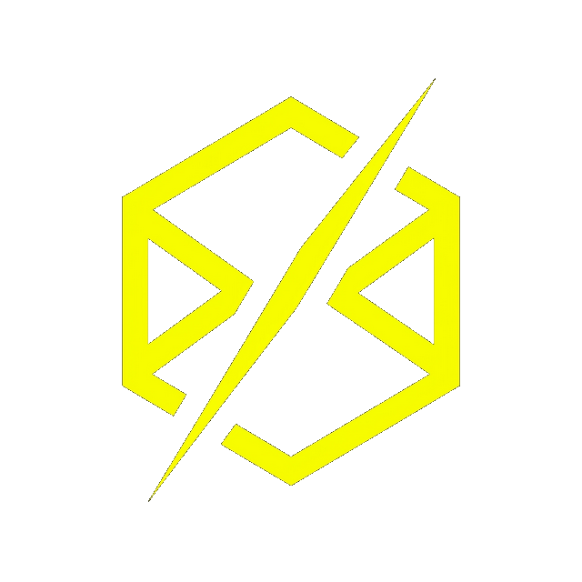

<p align="center">
  
</p>

<h1 align="center">AuditForge</h1>

<p align="center"><b>Automated Configuration Review Platform</b></p>

---

## Overview

A system can be fully patched and still be wide open, because it was *configured* insecurely — default credentials, a weak password policy, unnecessary services left running, or missing logging. These weaknesses rarely surface in a vulnerability scan, yet they are exactly what attackers exploit.

AuditForge automates the **configuration review** process from end to end. It checks the actual settings of a system against a security **benchmark**, turning what is normally a slow, manual, checklist-driven audit into a repeatable pipeline: define a benchmark, discover and organize targets, collect and evaluate their configuration, review the resulting findings, drive remediation, and produce an audit report.

## Features

- **Benchmark import & authoring** — build benchmarks in Benchmark Studio, or import them from a range of formats (CSV, NIST, STIG/XCCDF, Qualys, OpenVAS, ISO, HTML, and more), with assisted command generation and command-quality validation.
- **Client, mission & target management** — organize the systems under review by client and by mission.
- **Network discovery** — detect live hosts and fingerprint their services, including Active Directory environments.
- **Flexible scanning** — scan reachable hosts directly (agentless), or use a lightweight agent to reach isolated network segments; batch-scan many targets at once.
- **Configuration audit & evaluation** — collect host and device configuration, compare it against the benchmark, and generate findings.
- **AI assistant (Forge Copilot)** — optional, LLM-backed help for authoring benchmarks and commands and for classifying rules; supports multiple providers.
- **Remediation workflow (Forge Resolve)** — track findings through to resolution.
- **Multi-format reporting** — generate audit reports for clients and stakeholders.
- **Audit trail** — significant actions are recorded in an audit log.

## Tech stack

| Component | Technology |
|-----------|------------|
| Backend | Python, FastAPI, SQLAlchemy 2, Alembic, Pydantic v2 |
| Frontend | React 19, Vite, TypeScript, Tailwind CSS |
| Discovery agent | Standalone, containerized service |
| CLI | `auditforge` (Typer) |
| Storage | SQLite by default (any SQLAlchemy-supported database) |

## Getting started

### Windows installer
Run `installer/AuditForge-Setup.exe` and follow the wizard.

### Docker
```bash
cp .env.example .env          # set SECRET_KEY, JWT_SECRET_KEY, ENCRYPTION_KEY
docker compose up --build
```
The web UI is served at `http://localhost:5173` and the API at `http://localhost:8000` (interactive documentation at `/docs`).

### From source

**Backend**
```bash
cd backend
python -m venv .venv && source .venv/bin/activate     # Windows: .venv\Scripts\activate
pip install -r requirements.txt
alembic upgrade head
uvicorn backend.main:app --reload
```

**Frontend**
```bash
cd frontend
npm install
npm run dev
```

**CLI** (optional)
```bash
cd cli
pip install -e .
auditforge --help
```

## Configuration

Copy `.env.example` to `.env` and set, at minimum:

| Variable | Purpose |
|----------|---------|
| `SECRET_KEY` | Application signing secret |
| `JWT_SECRET_KEY` | Authentication-token signing |
| `ENCRYPTION_KEY` | Encryption key for stored credentials |
| `DATABASE_URL` | Database connection (defaults to `sqlite:///data/auditforge.db`) |

Use strong, unique values before deploying outside development.

## Project structure

```
backend/    FastAPI service — api, core, importers, models, schemas, connectors, ai, tools
frontend/   React + Vite web application
cli/        Typer command-line client
installer/  Windows installer
```

## Security

- Authentication is token-based (JWT), with token revocation.
- Stored credentials are encrypted at rest.
- Significant actions are recorded in an audit log.

Set strong secrets (`SECRET_KEY`, `JWT_SECRET_KEY`, `ENCRYPTION_KEY`) and serve over HTTPS in production.

---

<p align="center"><sub>© 2026 Louay Ouledali</sub></p>
